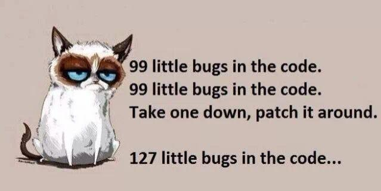

<p align="center">
  
</p>

# holbertonschool-Fix_My_Code_Challenge

> I didn't write the bugs — but I sure did fix them.

---

## 📄 Description

This repository contains my work on the **Fix My Code Challenge**, a debugging-first project from Holberton School. Rather than building something from scratch, I dove into pre-written, intentionally broken codebases across multiple languages and hunted down the bugs. Each task is a self-contained mystery: something is wrong, and it's my job to figure out what — and fix only that. No full rewrites allowed. The goal is surgical precision, not demolition.

---

## 🎯 Learning Objectives

Through this project, I significantly improved my ability to read and understand code written by others, even in languages I don't use daily. I developed stronger debugging instincts by learning to trace program behavior, identify logic errors, and spot off-by-one mistakes without the comfort of having written the code myself. I deepened my understanding of how Python, JavaScript, Ruby, and C each handle common programming patterns such as loops, object-oriented design, conditionals, and data structures. I am now able to approach an unfamiliar codebase with confidence, isolate the root cause of a bug, and apply a targeted fix that respects the original intent of the code.

---

## 📁 Repository Structure

```bash
holbertonschool-Fix_My_Code_Challenge/
├── assets/
│   ├── banner.jpeg
│   └── progress_barre_100.gif
├── challenge/
│   ├── 0-fizzbuzz.py
│   ├── 1-print_square.js
│   ├── 2-sort.rb
│   ├── 3-user.py
│   └── 4-delete_dnodeint/
│       ├── main.c
│       ├── free_dlistint.c
│       ├── print_dlistint.c
│       ├── add_dnodeint_end.c
│       └── delete_dnodeint_at_index.c
└── README.md
```

---

## ✨ Projects / Contents

### Task 0 - FizzBuzz
- Fixed the FizzBuzz logic so that multiples of both 3 and 5 correctly print `FizzBuzz` instead of just `Fizz`. Classic trap, classic fix.
- **Technologies:** Python 3

### Task 1 - Print Square
- Fixed a JavaScript script that prints a square of `#` characters so the dimensions actually match the argument passed. Geometry matters.
- **Technologies:** JavaScript (Node.js)

### Task 2 - Sort
- Fixed a Ruby script that sorts integer arguments from the command line, making sure non-numeric values like `C` or `fun` are properly ignored.
- **Technologies:** Ruby

### Task 3 - User Password
- Fixed a Python `User` class so that `is_valid_password` correctly returns `True` when the right password is provided — without printing errors to the terminal.
- **Technologies:** Python 3, OOP

### Task 4 - Double Linked List
- Fixed a C implementation of `delete_dnodeint_at_index` so that nodes are actually removed from a doubly linked list instead of being silently replaced by `0`.
- **Technologies:** C (gnu89 standard), doubly linked lists

---

## 🛠️ Technologies Used

This project spans four languages: Python 3 for scripting and object-oriented tasks, JavaScript with Node.js for output formatting, Ruby for argument handling and sorting, and C for low-level data structure management. Each fix is minimal and targeted, making the tech choices as varied as the bugs themselves.

---

## ⚙️ Prerequisites

- OS: Ubuntu 20.04 LTS
- Python 3
- Node.js
- Ruby
- GCC (with flags: `-Wall -pedantic -Werror -Wextra -std=gnu89`)
- Allowed editors: `vi`, `vim`, `emacs`

---

## ▶️ Usage

```bash
git clone https://github.com/GwenP88/holbertonschool-Fix_My_Code_Challenge.git
cd holbertonschool-Fix_My_Code_Challenge
```

All challenge files live inside the `challenge/` directory. Navigate there and run each file according to its language:

```bash
# Python
python3 challenge/0-fizzbuzz.py 50

# JavaScript
node challenge/1-print_square.js 10

# Ruby
ruby challenge/2-sort.rb 12 41 2 C 9 -9 31 fun -1 32

# C (Task 4 — compile first)
cd challenge/4-delete_dnodeint
gcc -Wall -pedantic -Werror -Wextra -std=gnu89 \
  main.c free_dlistint.c print_dlistint.c \
  add_dnodeint_end.c delete_dnodeint_at_index.c \
  -o delete_dnodeint
./delete_dnodeint
```

---

## 🤝 Contributions & Acknowledgements

Big thanks to the Holberton School team for crafting these wonderfully broken snippets — there's no better teacher than staring at someone else's bug at 11pm. Thanks also to the open-source community whose documentation and Stack Overflow threads saved me more than once. You know who you are.

---

## 👤 Author

**Gwenaelle PICHOT**
- Student at Holberton School
- Repository: holbertonschool-Fix_My_Code_Challenge
- GitHub: [@GwenP88](https://github.com/GwenP88)