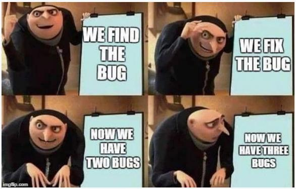

<p align="center">
  
</p>

# holbertonschool-Fix_My_Code_Challenge

> I didn't break it — I just inherited the mess. Time to fix it.

---

## 📝 Description

This project is a debugging-first challenge where I dive into existing code bases written in various languages and fix what's broken — without rewriting everything from scratch. The bugs range from logic errors to off-by-one nightmares, across Python, JavaScript, Ruby, and C. The goal isn't to be the author, it's to be the detective.

---

## 🎯 Learning Objectives

By completing this project, I improved my ability to read and understand code written by others, even in languages I'm not always familiar with. I sharpened my debugging instincts by identifying logic errors, incorrect conditions, and structural issues without the safety net of writing everything myself. I also reinforced my understanding of how different languages handle common programming patterns such as loops, object-oriented design, and data structures. At the end of this project, I am able to diagnose bugs confidently, trace program behavior, and apply targeted fixes that respect the original intent of the code.

---

## 🛠️ Technologies Used

This project spans multiple languages: Python 3 for scripting and OOP tasks, JavaScript (Node.js) for output formatting, Ruby for argument sorting, and C for low-level data structure management. Each file is a self-contained fix targeting a specific broken implementation.

---

## ⚙️ Requirements

- OS: Ubuntu 20.04 LTS
- Allowed editors: `vi`, `vim`, `emacs`
- All files must end with a new line
- A `README.md` file at the root of the project is mandatory
- No full rewrites — only targeted fixes are allowed

---

## 🚀 Installation

```bash
git clone https://github.com/GwenP88/holbertonschool-Fix_My_Code_Challenge.git
cd holbertonschool-Fix_My_Code_Challenge
```

---

## ▶️ Usage / Execution

Each file lives in the `challenge/` directory. Depending on the language:

**Python:**
```bash
chmod +x challenge/0-fizzbuzz.py
./challenge/0-fizzbuzz.py 50
# or
python3 challenge/0-fizzbuzz.py 50
```

**JavaScript:**
```bash
chmod +x challenge/1-print_square.js
./challenge/1-print_square.js 10
```

**Ruby:**
```bash
ruby challenge/2-sort.rb 12 41 2 C 9 -9 31 fun -1 32
```

**C (Task 4):**
```bash
gcc -Wall -pedantic -Werror -Wextra -std=gnu89 \
  main.c free_dlistint.c print_dlistint.c \
  add_dnodeint_end.c delete_dnodeint_at_index.c \
  -o delete_dnodeint
./delete_dnodeint
```

---

## 📊 Project Progress

<p align="center">

</p>

<p align="center">
<sub>Mandatory tasks completion: 100% --- Advanced tasks completion: 100%</sub>
</p>

---

## ✨ Features

### Task 0 - FizzBuzz

- **Status:** Mandatory
- **Objective:** Fix the FizzBuzz logic in Python so that multiples of both 3 and 5 correctly print `FizzBuzz` instead of just `Fizz`.
- **Constraint:** Only fix the bug — do not rewrite the function.
- **Expected behavior:** Running `./0-fizzbuzz.py 50` must output `FizzBuzz` at position 15 (and all other multiples of 15).

**Files:** `challenge/0-fizzbuzz.py`

---

### Task 1 - Print square

- **Status:** Mandatory
- **Objective:** Fix the JavaScript script that prints a square of `#` characters, so that the size matches the argument passed.
- **Constraint:** The square dimensions must scale correctly with the input number.
- **Expected behavior:** `./1-print_square.js 10` must print a 10×10 grid of `#`.

**Files:** `challenge/1-print_square.js`

---

### Task 2 - Sort

- **Status:** Mandatory
- **Objective:** Fix the Ruby script that sorts integer arguments passed from the command line.
- **Constraint:** Non-numeric arguments (like `C` or `fun`) must be ignored; only integers are sorted and printed.
- **Expected behavior:** `ruby 2-sort.rb 12 41 2 C 9 -9 31 fun -1 32` must output integers in ascending order.

**Files:** `challenge/2-sort.rb`

---

### Task 3 - User password

- **Status:** Mandatory
- **Objective:** Fix the Python `User` class so that `is_valid_password` returns `True` when the correct password is provided.
- **Constraint:** Tests must run without printing any errors to the terminal.
- **Expected behavior:** The script `./3-user.py` runs cleanly and the password validation works as expected.

**Files:** `challenge/3-user.py`

---

### Task 4 - Double linked list

- **Status:** Mandatory
- **Objective:** Fix the C implementation of `delete_dnodeint_at_index` so that nodes are correctly removed from a doubly linked list.
- **Constraint:** Only the deletion function needs to be fixed; the rest of the implementation stays intact.
- **Expected behavior:** After multiple deletions, the list shrinks properly and values like `98` are removed correctly (not replaced by `0`).

**Files:** `challenge/4-delete_dnodeint/`

---

## 🤝 Contributions & Acknowledgements

Big thanks to the Holberton School team for cooking up these delightfully broken snippets — nothing teaches debugging like staring at someone else's bug at 11pm. Special appreciation to the open-source community whose documentation saved me more than once.

---

## 👤 Author

**Gwenaelle PICHOT**
- Student at Holberton School
- Track: holbertonschool-Fix_My_Code_Challenge
- Project: holbertonschool-Fix_My_Code_Challenge - Background Context